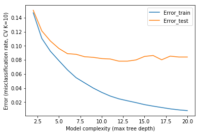

# Supervised Learning

The objective of classification in general is to find a model that maps input observations to output class labels. The objective of the classification problem for the spam data set is to determine which model best predicts whether a given email is spam or not spam based on the 57 features. Three classification models will be compared - Artificial Neural Networks, K-Nearest Neighbors and Decision Trees. 

## Artificial Neural Network (ANN)

An ANN is essentially a collection of nodes, "neurons" that maps a set of features to a set of class labels (in the case of classification). Neural network configurations vary by their cost function, activation function (nonlinearities), number of neurons, and hidden layers and selection of inputs. The ANN is trained by adjusting the biases and weights of neurons by the gradient descent optimization algorithm. Once trained, test observations are fed through the input layer and based on the weights and biases the ANN will output how the observation was classified. We train our data set using the simplest type of ANN, the feedforward neural network wherein connections between neurons do not form a cycle. The structure of our ANN has 1 hidden layer. The hidden units uses the hyperbolic tangent sigmoid transfer function and the output layer uses a linear transfer function.

Performance was plotted over a varying number of neurons. Notice that performance does not significantly improve past 6 neurons. The fluctuations may be attributed to the low resolution cross validation (2-fold) or low number of networks trained per fold. Increasing the number of folds or networks trained per fold my reduce fluctuations however the run time was unreasonable for this report. Further increasing the maximum number of epochs or hidden layers may have a positive effect on performance but again run time for such changes were unreasonable for this report.

The optimal number of hidden units is 26 however due to the fluctuations the optimal value changes with each cross validation fold. See the table below for summary over 10 folds.

## K-Nearest Neighbor (KNN)

KNN computes distances between observations (based on a distance measure), finds the $k$ nearest observations then classifies according to the majority of neighbors. If neighbor classifications are tied, a tie-breaking rule is executed. A test observation is classified by a majority vote of its $k$ neighbors. We use Euclidean distance as the distance measure.

KNN is sensitive to outliers, distance function and different scale features. There was no proof of outliers in the data set but to overcome the different scale problem we standardized the data before applying one layer leave-one-out cross validation. 

Performance was plotted over a varying number of neighbors, $k$. It indicates that $k=7$ is optimal where the classification error rate is the lowest. Observe, however that the error rate follows a somewhat linear trend upwards from $k=1$ which may suggest that if there were no fluctuations that $k=1$ may be optimal and that KNN may begin overfitting where $k>1$.

## Classification Decision Tree

A decision tree is trained by making 'splits' based on some attribute test condition then partitioning observations into subsets according to the test condition. If all observations on a branch belongs to the same class, that branch becomes a leaf node. Splits are determined by calculating impurity and making a split that reduces impurity the most. There are multiple impurity measures but for our model we have chosen the Gini criterion where impurity is given by $\textrm{Gini}(t)=1-\sum_{i=0}^{c-1}(p(i|t))^2$.

Each test observation is passed through the tree, starting at the root node until it reaches a leaf which is the predicted class label.

Performance was plotted as a function of the maximum tree depth. Performance reaches somewhat of a steady state after a maximum tree depth of 7. Also notice how training error tends towards 0% as the models complexity goes to infinity. Test error is the more accurate measure as it accounts for overfitting which training error does not.

## Model Comparison

The inner layer yields information about optimal parameters. A second round of cross validation, the outer layer, accepts the optimal parameters from the inner layer and performs cross validation using these parameters. 10-fold cross validation was used for the outer layer. The table below exhibits the output optimal parameters of the inner layer for each model over each fold and the corresponding generalization error. The figure below graphs the errors over each fold.

| Fold     | Optimal Hidden Units | ANN Error (%) | Optimal Neighbors | KNN Error (%) | Optimal Tree Depth | Decision Tree Error (%) |
| -------- | -------------------- | ------------- | ----------------- | ------------- | ------------------ | ----------------------- |
| 1        | 28                   | 4.56          | 1                 | 7.81          | 10                 | 7.38                    |
| 2        | 25                   | 4.35          | 5                 | 9.78          | 7                  | 10.43                   |
| 3        | 22                   | 7.17          | 5                 | 7.17          | 8                  | 7.83                    |
| 4        | 13                   | 4.35          | 1                 | 6.52          | 9                  | 8.70                    |
| 5        | 32                   | 5.22          | 1                 | 6.52          | 11                 | 5.65                    |
| 6        | 19                   | 5.87          | 1                 | 8.04          | 10                 | 8.91                    |
| 7        | 28                   | 4.57          | 3                 | 7.40          | 14                 | 6.30                    |
| 8        | 25                   | 6.09          | 1                 | 7.61          | 10                 | 7.39                    |
| 9        | 17                   | 8.04          | 5                 | 9.57          | 11                 | 9.78                    |
| 10       | 26                   | 5.87          | 1                 | 6.52          | 9                  | 8.70                    |
| **Mean** | 23.5                 | 5.61          | 2.4               | 7.69          | 9.9                | 8.11                    |

ANN performed the best with a mean error of 5.61% followed by KNN with 7.69% then decision tree with 8.11%. These results are in line with the results of the data set authors whom achieved a misclassification rate of around 7%. The very low error rate of ANN may suggest it is overfitting the data. This may lead to false positives where good mail is marked as spam. This is undesirable in practical application. Further work may be performed to avoid false positives.

There is a reasonable amount of variation in optimal parameters. This may be attributed to the lower 'resolution' cross validation in the inner layers. Using the leave-one-out method may result in less variance however this was not reasonable due to the run time. For ANN increasing the number of networks trained per fold and increasing the maximum number of epochs may have yielded a more stable output, however this again was unreasonable due to run time. 

The two best performing models was ANN and KNN. The figure above compares their generalization error spreads over 10 cross validation folds. Credibility interval analysis demonstrates that ANN significantly outperforms KNN.

Non-spam represents the majority of total emails at 60.6%. Using the majority class as a predictor yields a generalization error of 39.4% compared to 5.61%, 7.69% and 8.11% mean error for ANN, KNN and decision tree respectively.​